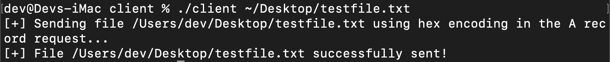
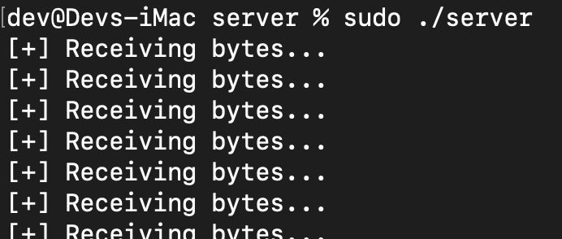

# DNS Exfil Test Tool

This is a very basic file exfiltration tool that uses DNS A and AAAA records to exfiltrate files. This is a simple tool to easily test for detections for file exfiltration via DNS. The client sends the specified file as both A and AAAA requests, and currently the server responds just to A record requests with a bogus IP response. If Bro (Zeek) is being used, this tool should flag for anomalous dns traffic.

----------------------

To Use: **Server Side**
1. On your intended server, copy the go-dnsserver.go file and build on the server (**go build**)
2. Start it: **sudo ./server**
3. The server will then listen for incoming DNS connections
4. The server will resolve any request it receives to 10.10.10.10

To Use: **Client Side**
1. Copy the go-dnsclient.go file over to the client you plan to test it on
2. Change the dns server IP in the client code from 127.0.0.1 to whatever IP you are using for the server 
3. Build (**go build**) 
4. Run the client and feed it a single parameter which is the path to the file you want to exfil. Example:

**./client ~/Desktop/testfile.txt**

5. the client will then read the contents of the file, hex encode it, and send it in 10 character chunks as A record requests. The format of each request is:
[10 hex encoded characters].macconsultants.com
6. Once done the server will take all of the hex encoded data, combine, and unhexlify it to a file as ASCII in the same directory. The output file is called outfile.
7. The server will not indicate when done but the client does. Once the client says it is done, you can kill the server and view the contents of outfile.
8. You will need to rename the outfile if you want to send multiple files.

----------------------

***Example Execution:***

**Client**

**Server**

